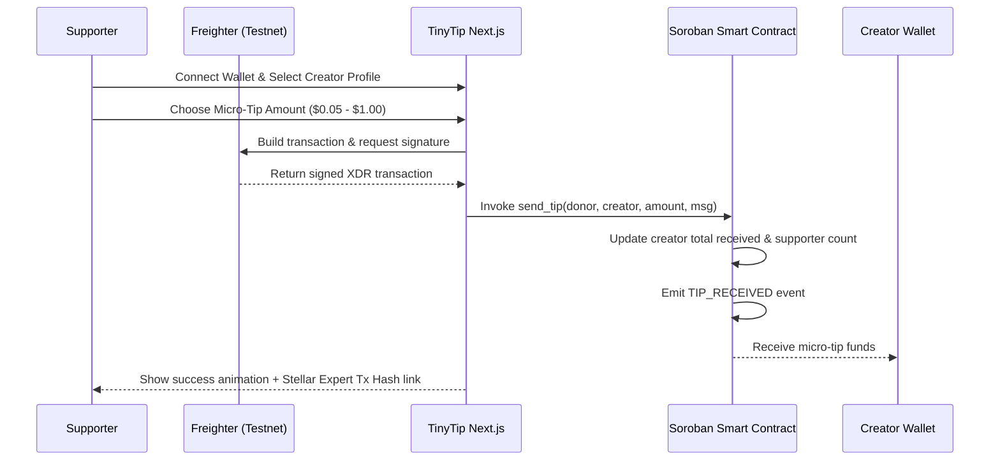
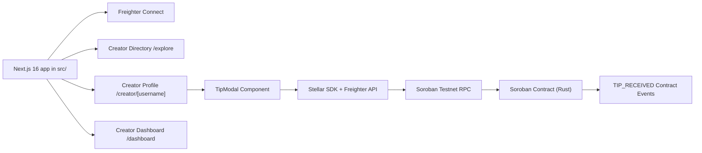

a

<div align="center">
  <span style="font-size: 64px;">✨</span>
  <h1>TinyTip</h1>
  <p>Small tips. Real impact. On-chain micro-support platform for Stellar Testnet.</p>

---

TinyTip is a Stellar Testnet MVP for **micro-support and financial tipping** for creators, open-source developers, artists, writers, and public goods projects.

Instead of traditional crowdfunding or credit-card payment gateways that charge heavy fixed fees ($0.30+ per transaction), TinyTip leverages **Stellar Soroban smart contracts** and sub-cent network fees to allow users to financially reward creators with payments as small as **$0.05, $0.10, $0.25, $0.50, and $1.00**.

> [!IMPORTANT]
> TinyTip is designed specifically for **Stellar Journey to Mastery (Builder & Startup Tracks)**. Every micro-support tip generates a real-time, on-chain Soroban transaction, updating creator statistics and emitting `TIP_RECEIVED` events on Stellar Testnet.

[Contract Explorer](https://stellar.expert/explorer/testnet/contract/CA54QDAYDLAUENAJYIELIYFFTPC7OAXOVNL5B4DEME3NWOTTTWZ2PSDH) · [Stellar Lab](https://lab.stellar.org/r/testnet/contract/CA54QDAYDLAUENAJYIELIYFFTPC7OAXOVNL5B4DEME3NWOTTTWZ2PSDH) · [Contract Source](contracts/notes/src/lib.rs)

---

## What Is TinyTip?

TinyTip is an effortless micro-donation layer for content creators and open-source maintainers who want to accept instant appreciation payments without friction.

```text
User / Supporter
-> Connect Freighter Wallet
-> Select Creator & Micro-Tip Preset ($0.05 - $1.00)
-> Soroban Contract execute tip & emit event
-> Creator receives funds + statistics update on-chain
```

TinyTip handles:

- Freighter Testnet wallet connection & transaction signing.
- Micro-tip preset conversions ($0.05 $\rightarrow$ 0.5 XLM, $0.10 $\rightarrow$ 1.0 XLM, $0.25 $\rightarrow$ 2.5 XLM, $0.50 $\rightarrow$ 5.0 XLM, $1.00 $\rightarrow$ 10.0 XLM).
- On-chain creator registration (`register_creator`).
- Atomic tip execution & stats tracking (`send_tip`).
- Soroban event emission (`TIP_RECEIVED`).
- Public Creator URL sharing (`/creator/[username]`).
- Real-time recent activity feeds and dashboard analytics.

---

## Review Path

For a hackathon reviewer or demo session:

1. Open `http://localhost:3000`.
2. Connect **Freighter Wallet** set to **Stellar Testnet**.
3. Explore featured creators on the home page or go to `/explore`.
4. Click **"❤️ Send Micro-Tip"** on any creator card (e.g., `@ahan`).
5. Select a micro-amount ($0.05, $0.10, $0.25, $0.50, or $1.00) and type an optional support message.
6. Click **"Send Micro-Tip"** and approve the transaction in Freighter.
7. Observe the celebratory success modal with transaction hash and click the **Stellar Expert Explorer** link.
8. Navigate to `/dashboard` to view creator statistics (Total Received, Supporters Count, Tip Count).
9. Navigate to `/create-profile` to register a new creator profile on-chain on Soroban Testnet.

---

## Core Flow



---

## Architecture



### Stack

- **Frontend:** Next.js 16 (App Router), React 19, Tailwind CSS v4, Glassmorphic UI design.
- **Wallet Integration:** `@stellar/freighter-api` on Stellar Testnet.
- **Stellar SDK:** `@stellar/stellar-sdk` v14 (Soroban RPC integration).
- **Smart Contract:** Soroban Rust Contract in `contracts/notes`.
- **Testing:** Rust unit tests (`cargo test`) & Next.js TypeScript type checking.

---

## Features

### Supporter / User

- Connect Freighter Wallet on Stellar Testnet with 1-click.
- Micro-tip creators instantly with amounts as low as $0.05 (0.5 XLM).
- Include optional encouraging messages with tips.
- View real-time transaction receipts linked to Stellar Expert Explorer.

### Creator

- Register a profile on-chain with display name, `@username`, and bio.
- Get a public shareable support link (`/creator/[username]`).
- Track total received funds, unique supporters, and tip count in real-time.
- View supporter messages in the Creator Dashboard.

### Hackathon Reviewer / Judge

- Verified Soroban smart contract deployed on Stellar Testnet.
- Passed 100% Rust unit tests (`cargo test`).
- High-volume transaction use-case tailored to Stellar's low-fee advantage.
- Clean, production-ready full-stack architecture.

---

## Smart Contract Interface

Soroban Rust contract exported functions:

| Method               | Parameters                                   | Description                                                |
| -------------------- | -------------------------------------------- | ---------------------------------------------------------- |
| `register_creator` | `username, name, bio, wallet`              | Registers a creator profile on-chain                       |
| `send_tip`         | `donor, creator_username, amount, message` | Executes tip, updates stats, & emits`TIP_RECEIVED` event |
| `get_creator`      | `username`                                 | Retrieves profile stats for a specific creator             |
| `get_all_creators` | None                                         | Returns all registered creator profiles                    |
| `get_recent_tips`  | None                                         | Returns latest tip records across the platform             |

---

## Local Development

### Requirements

- Node.js 20.x or later
- npm
- Rust & `wasm32-unknown-unknown` target
- Stellar CLI 26 or later
- Freighter Wallet extension for browser testing

### Setup & Run

```bash
# Clone the repository
git clone https://github.com/your-username/tinytip.git
cd tinytip

# Install dependencies
npm install

# Run smart contract unit tests
cargo test --manifest-path contracts/notes/Cargo.toml

# Build smart contract WASM
stellar contract build --manifest-path contracts/notes/Cargo.toml

# Run Next.js dev server
npm run dev
```

Open [http://localhost:3000](http://localhost:3000) in your browser.

---

## Deployed Smart Contract Details

| Field                             | Value                                                                                                                                     |
| --------------------------------- | ----------------------------------------------------------------------------------------------------------------------------------------- |
| **Network**                 | Stellar Soroban Testnet                                                                                                                   |
| **Contract ID**             | `CA54QDAYDLAUENAJYIELIYFFTPC7OAXOVNL5B4DEME3NWOTTTWZ2PSDH`                                                                              |
| **Deployer Account**        | `sayyidusy` (`GA22G44TKSBBH325D2JONN5AES33FDZKB33JZATM6P3R3V3WVMHHE3IH`)                                                              |
| **Stellar Expert Explorer** | [View Contract ID CA54Q...PSDH](https://stellar.expert/explorer/testnet/contract/CA54QDAYDLAUENAJYIELIYFFTPC7OAXOVNL5B4DEME3NWOTTTWZ2PSDH) |
| **Stellar Lab Explorer**    | [View Contract ID on Stellar Lab](https://lab.stellar.org/r/testnet/contract/CA54QDAYDLAUENAJYIELIYFFTPC7OAXOVNL5B4DEME3NWOTTTWZ2PSDH)     |

---

## Verification & Test Results

Run from project root:

```bash
# Run Rust smart contract tests
cargo test --manifest-path contracts/notes/Cargo.toml

# Run Next.js production build check
npm run build
```

Expected results:

| Check                      | Status  | Details                                                                |
| -------------------------- | ------- | ---------------------------------------------------------------------- |
| Soroban Rust Unit Tests    | ✅ Pass | 2 passing tests (`test_register_and_get_creator`, `test_send_tip`) |
| WASM Contract Compilation  | ✅ Pass | `notes.wasm` (6,655 bytes) compiled cleanly                          |
| Stellar Testnet Deployment | ✅ Pass | Deployed to`CA54Q...PSDH` via `sayyidusy`                          |
| TypeScript Typecheck       | ✅ Pass | 0 errors                                                               |
| Next.js Production Build   | ✅ Pass | 6 static & dynamic pages rendered cleanly                              |

---

## Project Structure

```text
inventory-dapps/
├── contracts/
│   └── notes/                  # Soroban smart contract source (Rust)
│       ├── src/
│       │   ├── lib.rs          # Contract impl (register_creator, send_tip)
│       │   └── test.rs         # Soroban contract unit tests
│       └── Cargo.toml
├── src/
│   ├── app/
│   │   ├── create-profile/     # Creator onboarding page (/create-profile)
│   │   ├── creator/[username]/ # Individual creator profile page (/creator/ahan)
│   │   ├── dashboard/          # Creator analytics dashboard (/dashboard)
│   │   ├── explore/            # Creator search directory (/explore)
│   │   ├── globals.css         # Glassmorphic Tailwind 4 styling
│   │   ├── layout.tsx          # Root layout & Navbar
│   │   └── page.tsx            # Home page hero & activity feed
│   ├── components/             # Navbar, Footer, CreatorCard, TipModal, ActivityFeed
│   └── lib/
│       └── stellar.ts          # Stellar SDK & Freighter wallet helpers
├── README.md
├── package.json
└── tsconfig.json
```
